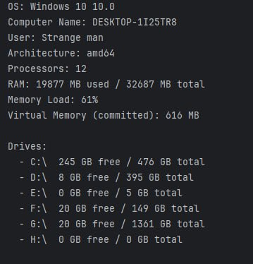
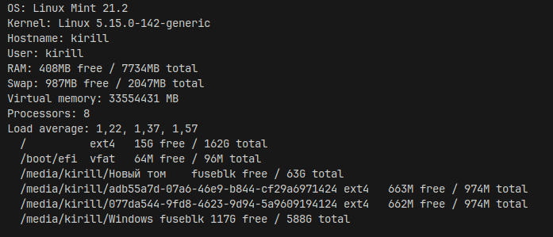

<h1>Операционные системы</h1>
<h4>Лабораторная работа №1 (23.11.2025)</h4>
<h4>Михайлов Кирилл Николаевич ИТ-4</h4>

## Задание 1
### Постановка задачи
Научиться работать с Windows API для получения системной информации, реализовать структурированный и надёжный код, который:

Обрабатывает все возможные ошибки корректно,
Даёт студенту понимание, как устроена система "под капотом".
Напишите программу sys-info-win для ОС Windows, которая бы выводила в консоль информацию о компьютере на котором она запущена:

Версия операционной системы.
Используйте IsWindows10OrGreater() и аналоги из VersionHelpers.h
Размер виртуальной и физической памяти, а также использование памяти в процентах.
Количество ядер процессора
Имя компьютера и имя пользователя
Архитектура процессора (x86, x64, ARM)
Размер файла подкачки (функция GetPerformanceInfo)
Список логических дисков + их объёмы

### Процесс решения
Создадим класс `SysInfoWin`, в нем будет главный метод `main`. В методе `main` будет выводиться информация об системе, остальные методы будут вспомогательными.
С помощью класса `System` мы получил имя и версию ОС, а так же имя текущего пользователя. С помощью метода `getHostname` мы получил сетевое имя компьютера. С помощью класса `ManagementFactory` мы получил доступ к ОС, благодаря чему узнаем кол.-во ядер и кол.-во RAM. С помощью метода `printPagefileInfo` мы получил информацию об файле подкачки. С помощью класса `File` мы получил доступ к файлам системы и сможем вывести все корневые директории. Метод `printPagefileInfo` запускает системную команду *wmic*. Метод `getHostName` использует класс `IntetAddress` для получения сетевой информации.

### Результат запуска

### Вывод
Скрипт не видет **Pagefile**.

### Приложение
[SysInfoWin.java](./SysInfoWin.java)

## Задание 2
### Постановка задачи
Напишите программу sys-info-linux для ОС Linux, которая бы выводила в консоль информацию о компьютере, на котором запущена:

Версия ядра и дистрибутива
Используйте `uname()` для ядра
Используйте `lsb_release()` или чтение `/etc/os-release`
Количество свободной и имеющейся оперативной памяти (в мегабайтах)
Используйте sysinfo или парсинг `/proc/meminfo`.
Количество логических процессоров (`get_nprocs()`)
Архитектура процессора
Используйте `uname().machine`
Загрузка процессора (из `sysinfo.loads`) или `/proc/loadavg`.
Список подключенных логических дисков
прочитать `/proc/mounts` или вызывать `getmntent`.
Получить статистику через statvfs()
Информация о текущем пользователе и `hostname`
`getlogin()`, `gethostname()` или `getpwuid(getuid())`.
Объём доступной виртуальной памяти
Через `/proc/meminfo`, поле `VmallocTotal` (если доступно)

### Процесс решения
Создадим класс `SysInfoLinux`, в нем будет главный метод `main`. В методе `main` будет выводиться информация об системе, остальные методы будут вспомогательными. Метод `runCommand` запускает команду в командной строке Linux. Метод `readFile` и `readFileLine` читает содержимое файлов. Метод `extractValue` ищет чиста в тексте. С помощью команды `lsb_release -d` можно узнать название ОС, если команда не сработает, то можно прочитать файл `/etc/os-release`. С помощью команды `uname -r` можно узнать информацию об ядре. С помощью команды `hostname` можно узнать имя компьютера в сети. С помощью класса `System` можно узнать имя текущего пользователя. Если прочитать файл `/proc/meminfo`, то можно узнать информацию о памяти (RAM, Swap и виртуальная память). С помощью команды `nproc` можно узнать кол.-во ядер процессора. С помощью команды `df -h --output=target,fstype,avail,size` можно узнать информацию о всех подключенных дисках.

### Результат запуска

### Вывод
Скрипт работает корректно.

### Приложение
[SysInfoLinux.java](./SysInfoLinux.java)